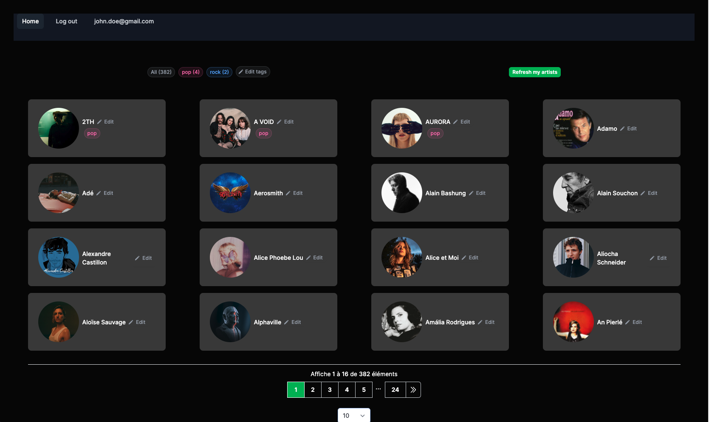

# Spotify Library

A custom Spotify interface to visualize your followed artists and sort them by custom tags

## Why this project ?

This side project is dedicated to 3 main goals:

1. 💡 solving a personal problem that I have when listening music on Spotify : I'm always listening to the same artists because I can't visualize them with good filters like their genres, custom tags, grid view or list, etc...
2. 📈 improving my skills as Web Developper on Ruby on Rails by consuming an external API, creatings features, managing deployments
3. 👨‍🏫 Learning how to use Rails 7 importmap feature, Hotwire, Stimulus and Turbo

## Setup

1. Pull down the app from version control
2. Make sure you have Postgres running
3. `bin/setup`
4. Create the files :
   - `.env.development.local`
   - `.env.test.local`
5. Fill the env vars of these files with your Spotify's API Keys. You can create some [here](https://developer.spotify.com/documentation/web-api).  

## Running the App

1. `bin/run`

## Tests and CI

1. `bin/ci` contains all the tests and checks for the app
2. `tmp/test.log` will use the production logging format
   *not* the development one.

## Production

* All runtime configuration should be supplied in the UNIX environment
* Rails logging uses lograge. `bin/setup help` can tell you how to see this locally

## Features

- Fetch your followed artists from Spotify
- Add custom tags on each artists
- Filter your artists by tags
- Navigate through your followed artists with the pagination or with [`⬅ / ➡`] [`⌘ + ⬅ / ➡`] 

## Authors

- [@davidBentoPereira](https://github.com/davidBentoPereira) (author)
- [@crysicia](https://github.com/Crysicia) (contributor)

